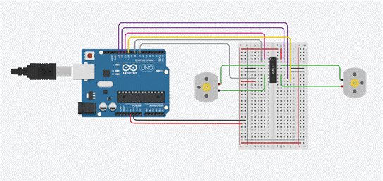
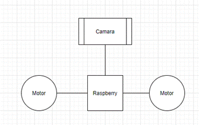
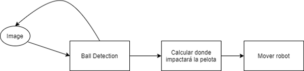
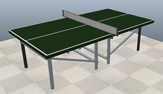
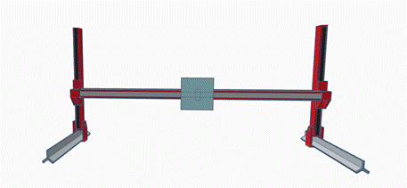
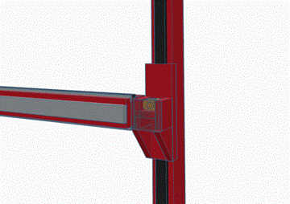
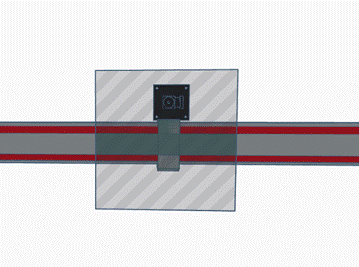
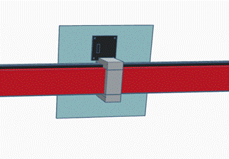
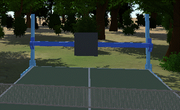

<html xmlns:v="urn:schemas-microsoft-com:vml"
xmlns:o="urn:schemas-microsoft-com:office:office"
xmlns:w="urn:schemas-microsoft-com:office:word"
xmlns:m="http://schemas.microsoft.com/office/2004/12/omml"
xmlns="http://www.w3.org/TR/REC-html40">

<head>
<meta http-equiv=Content-Type content="text/html; charset=windows-1252">
<meta name=ProgId content=Word.Document>
<meta name=Generator content="Microsoft Word 15">
<meta name=Originator content="Microsoft Word 15">
<link rel=File-List href="readme_archivos/filelist.xml">
<link rel=Edit-Time-Data href="readme_archivos/editdata.mso">
<!--[if !mso]>

<![endif]--><!--[if gte mso 9]><xml>
 <o:DocumentProperties>
  <o:Author>cvc cvc</o:Author>
  <o:LastAuthor>Gerard Martínez Espelleta</o:LastAuthor>
  <o:Revision>2</o:Revision>
  <o:TotalTime>0</o:TotalTime>
  <o:Created>2021-05-19T13:46:00Z</o:Created>
  <o:LastSaved>2021-05-19T13:46:00Z</o:LastSaved>
  <o:Pages>1</o:Pages>
  <o:Words>1574</o:Words>
  <o:Characters>8663</o:Characters>
  <o:Lines>72</o:Lines>
  <o:Paragraphs>20</o:Paragraphs>
  <o:CharactersWithSpaces>10217</o:CharactersWithSpaces>
  <o:Version>16.00</o:Version>
 </o:DocumentProperties>
</xml><![endif]-->
<link rel=dataStoreItem href="readme_archivos/item0001.xml"
target="readme_archivos/props002.xml">
<link rel=themeData href="readme_archivos/themedata.thmx">
<link rel=colorSchemeMapping href="readme_archivos/colorschememapping.xml">
<!--[if gte mso 9]><xml>
 <w:WordDocument>
  <w:TrackMoves>false</w:TrackMoves>
  <w:TrackFormatting/>
  <w:HyphenationZone>21</w:HyphenationZone>
  <w:PunctuationKerning/>
  <w:ValidateAgainstSchemas/>
  <w:SaveIfXMLInvalid>false</w:SaveIfXMLInvalid>
  <w:IgnoreMixedContent>false</w:IgnoreMixedContent>
  <w:AlwaysShowPlaceholderText>false</w:AlwaysShowPlaceholderText>
  <w:DoNotPromoteQF/>
  <w:LidThemeOther>ES</w:LidThemeOther>
  <w:LidThemeAsian>X-NONE</w:LidThemeAsian>
  <w:LidThemeComplexScript>X-NONE</w:LidThemeComplexScript>
  <w:Compatibility>
   <w:BreakWrappedTables/>
   <w:SnapToGridInCell/>
   <w:WrapTextWithPunct/>
   <w:UseAsianBreakRules/>
   <w:DontGrowAutofit/>
   <w:SplitPgBreakAndParaMark/>
   <w:EnableOpenTypeKerning/>
   <w:DontFlipMirrorIndents/>
   <w:OverrideTableStyleHps/>
  </w:Compatibility>
  <w:DoNotOptimizeForBrowser/>
  <m:mathPr>
   <m:mathFont m:val="Cambria Math"/>
   <m:brkBin m:val="before"/>
   <m:brkBinSub m:val="&#45;-"/>
   <m:smallFrac m:val="off"/>
   <m:dispDef/>
   <m:lMargin m:val="0"/>
   <m:rMargin m:val="0"/>
   <m:defJc m:val="centerGroup"/>
   <m:wrapIndent m:val="1440"/>
   <m:intLim m:val="subSup"/>
   <m:naryLim m:val="undOvr"/>
  </m:mathPr></w:WordDocument>
</xml><![endif]--><!--[if gte mso 9]><xml>
 <w:LatentStyles DefLockedState="false" DefUnhideWhenUsed="false"
  DefSemiHidden="false" DefQFormat="false" DefPriority="99"
  LatentStyleCount="376">
  <w:LsdException Locked="false" Priority="0" QFormat="true" Name="Normal"/>
  <w:LsdException Locked="false" Priority="9" QFormat="true" Name="heading 1"/>
  <w:LsdException Locked="false" Priority="9" SemiHidden="true"
   UnhideWhenUsed="true" QFormat="true" Name="heading 2"/>
  <w:LsdException Locked="false" Priority="9" SemiHidden="true"
   UnhideWhenUsed="true" QFormat="true" Name="heading 3"/>
  <w:LsdException Locked="false" Priority="9" SemiHidden="true"
   UnhideWhenUsed="true" QFormat="true" Name="heading 4"/>
  <w:LsdException Locked="false" Priority="9" SemiHidden="true"
   UnhideWhenUsed="true" QFormat="true" Name="heading 5"/>
  <w:LsdException Locked="false" Priority="9" SemiHidden="true"
   UnhideWhenUsed="true" QFormat="true" Name="heading 6"/>
  <w:LsdException Locked="false" Priority="9" SemiHidden="true"
   UnhideWhenUsed="true" QFormat="true" Name="heading 7"/>
  <w:LsdException Locked="false" Priority="9" SemiHidden="true"
   UnhideWhenUsed="true" QFormat="true" Name="heading 8"/>
  <w:LsdException Locked="false" Priority="9" SemiHidden="true"
   UnhideWhenUsed="true" QFormat="true" Name="heading 9"/>
  <w:LsdException Locked="false" SemiHidden="true" UnhideWhenUsed="true"
   Name="index 1"/>
  <w:LsdException Locked="false" SemiHidden="true" UnhideWhenUsed="true"
   Name="index 2"/>
  <w:LsdException Locked="false" SemiHidden="true" UnhideWhenUsed="true"
   Name="index 3"/>
  <w:LsdException Locked="false" SemiHidden="true" UnhideWhenUsed="true"
   Name="index 4"/>
  <w:LsdException Locked="false" SemiHidden="true" UnhideWhenUsed="true"
   Name="index 5"/>
  <w:LsdException Locked="false" SemiHidden="true" UnhideWhenUsed="true"
   Name="index 6"/>
  <w:LsdException Locked="false" SemiHidden="true" UnhideWhenUsed="true"
   Name="index 7"/>
  <w:LsdException Locked="false" SemiHidden="true" UnhideWhenUsed="true"
   Name="index 8"/>
  <w:LsdException Locked="false" SemiHidden="true" UnhideWhenUsed="true"
   Name="index 9"/>
  <w:LsdException Locked="false" Priority="39" SemiHidden="true"
   UnhideWhenUsed="true" Name="toc 1"/>
  <w:LsdException Locked="false" Priority="39" SemiHidden="true"
   UnhideWhenUsed="true" Name="toc 2"/>
  <w:LsdException Locked="false" Priority="39" SemiHidden="true"
   UnhideWhenUsed="true" Name="toc 3"/>
  <w:LsdException Locked="false" Priority="39" SemiHidden="true"
   UnhideWhenUsed="true" Name="toc 4"/>
  <w:LsdException Locked="false" Priority="39" SemiHidden="true"
   UnhideWhenUsed="true" Name="toc 5"/>
  <w:LsdException Locked="false" Priority="39" SemiHidden="true"
   UnhideWhenUsed="true" Name="toc 6"/>
  <w:LsdException Locked="false" Priority="39" SemiHidden="true"
   UnhideWhenUsed="true" Name="toc 7"/>
  <w:LsdException Locked="false" Priority="39" SemiHidden="true"
   UnhideWhenUsed="true" Name="toc 8"/>
  <w:LsdException Locked="false" Priority="39" SemiHidden="true"
   UnhideWhenUsed="true" Name="toc 9"/>
  <w:LsdException Locked="false" SemiHidden="true" UnhideWhenUsed="true"
   Name="Normal Indent"/>
  <w:LsdException Locked="false" SemiHidden="true" UnhideWhenUsed="true"
   Name="footnote text"/>
  <w:LsdException Locked="false" SemiHidden="true" UnhideWhenUsed="true"
   Name="annotation text"/>
  <w:LsdException Locked="false" SemiHidden="true" UnhideWhenUsed="true"
   Name="header"/>
  <w:LsdException Locked="false" SemiHidden="true" UnhideWhenUsed="true"
   Name="footer"/>
  <w:LsdException Locked="false" SemiHidden="true" UnhideWhenUsed="true"
   Name="index heading"/>
  <w:LsdException Locked="false" Priority="35" SemiHidden="true"
   UnhideWhenUsed="true" QFormat="true" Name="caption"/>
  <w:LsdException Locked="false" SemiHidden="true" UnhideWhenUsed="true"
   Name="table of figures"/>
  <w:LsdException Locked="false" SemiHidden="true" UnhideWhenUsed="true"
   Name="envelope address"/>
  <w:LsdException Locked="false" SemiHidden="true" UnhideWhenUsed="true"
   Name="envelope return"/>
  <w:LsdException Locked="false" SemiHidden="true" UnhideWhenUsed="true"
   Name="footnote reference"/>
  <w:LsdException Locked="false" SemiHidden="true" UnhideWhenUsed="true"
   Name="annotation reference"/>
  <w:LsdException Locked="false" SemiHidden="true" UnhideWhenUsed="true"
   Name="line number"/>
  <w:LsdException Locked="false" SemiHidden="true" UnhideWhenUsed="true"
   Name="page number"/>
  <w:LsdException Locked="false" SemiHidden="true" UnhideWhenUsed="true"
   Name="endnote reference"/>
  <w:LsdException Locked="false" SemiHidden="true" UnhideWhenUsed="true"
   Name="endnote text"/>
  <w:LsdException Locked="false" SemiHidden="true" UnhideWhenUsed="true"
   Name="table of authorities"/>
  <w:LsdException Locked="false" SemiHidden="true" UnhideWhenUsed="true"
   Name="macro"/>
  <w:LsdException Locked="false" SemiHidden="true" UnhideWhenUsed="true"
   Name="toa heading"/>
  <w:LsdException Locked="false" SemiHidden="true" UnhideWhenUsed="true"
   Name="List"/>
  <w:LsdException Locked="false" SemiHidden="true" UnhideWhenUsed="true"
   Name="List Bullet"/>
  <w:LsdException Locked="false" SemiHidden="true" UnhideWhenUsed="true"
   Name="List Number"/>
  <w:LsdException Locked="false" SemiHidden="true" UnhideWhenUsed="true"
   Name="List 2"/>
  <w:LsdException Locked="false" SemiHidden="true" UnhideWhenUsed="true"
   Name="List 3"/>
  <w:LsdException Locked="false" SemiHidden="true" UnhideWhenUsed="true"
   Name="List 4"/>
  <w:LsdException Locked="false" SemiHidden="true" UnhideWhenUsed="true"
   Name="List 5"/>
  <w:LsdException Locked="false" SemiHidden="true" UnhideWhenUsed="true"
   Name="List Bullet 2"/>
  <w:LsdException Locked="false" SemiHidden="true" UnhideWhenUsed="true"
   Name="List Bullet 3"/>
  <w:LsdException Locked="false" SemiHidden="true" UnhideWhenUsed="true"
   Name="List Bullet 4"/>
  <w:LsdException Locked="false" SemiHidden="true" UnhideWhenUsed="true"
   Name="List Bullet 5"/>
  <w:LsdException Locked="false" SemiHidden="true" UnhideWhenUsed="true"
   Name="List Number 2"/>
  <w:LsdException Locked="false" SemiHidden="true" UnhideWhenUsed="true"
   Name="List Number 3"/>
  <w:LsdException Locked="false" SemiHidden="true" UnhideWhenUsed="true"
   Name="List Number 4"/>
  <w:LsdException Locked="false" SemiHidden="true" UnhideWhenUsed="true"
   Name="List Number 5"/>
  <w:LsdException Locked="false" Priority="10" QFormat="true" Name="Title"/>
  <w:LsdException Locked="false" SemiHidden="true" UnhideWhenUsed="true"
   Name="Closing"/>
  <w:LsdException Locked="false" SemiHidden="true" UnhideWhenUsed="true"
   Name="Signature"/>
  <w:LsdException Locked="false" Priority="1" SemiHidden="true"
   UnhideWhenUsed="true" Name="Default Paragraph Font"/>
  <w:LsdException Locked="false" SemiHidden="true" UnhideWhenUsed="true"
   Name="Body Text"/>
  <w:LsdException Locked="false" SemiHidden="true" UnhideWhenUsed="true"
   Name="Body Text Indent"/>
  <w:LsdException Locked="false" SemiHidden="true" UnhideWhenUsed="true"
   Name="List Continue"/>
  <w:LsdException Locked="false" SemiHidden="true" UnhideWhenUsed="true"
   Name="List Continue 2"/>
  <w:LsdException Locked="false" SemiHidden="true" UnhideWhenUsed="true"
   Name="List Continue 3"/>
  <w:LsdException Locked="false" SemiHidden="true" UnhideWhenUsed="true"
   Name="List Continue 4"/>
  <w:LsdException Locked="false" SemiHidden="true" UnhideWhenUsed="true"
   Name="List Continue 5"/>
  <w:LsdException Locked="false" SemiHidden="true" UnhideWhenUsed="true"
   Name="Message Header"/>
  <w:LsdException Locked="false" Priority="11" QFormat="true" Name="Subtitle"/>
  <w:LsdException Locked="false" SemiHidden="true" UnhideWhenUsed="true"
   Name="Salutation"/>
  <w:LsdException Locked="false" SemiHidden="true" UnhideWhenUsed="true"
   Name="Date"/>
  <w:LsdException Locked="false" SemiHidden="true" UnhideWhenUsed="true"
   Name="Body Text First Indent"/>
  <w:LsdException Locked="false" SemiHidden="true" UnhideWhenUsed="true"
   Name="Body Text First Indent 2"/>
  <w:LsdException Locked="false" SemiHidden="true" UnhideWhenUsed="true"
   Name="Note Heading"/>
  <w:LsdException Locked="false" SemiHidden="true" UnhideWhenUsed="true"
   Name="Body Text 2"/>
  <w:LsdException Locked="false" SemiHidden="true" UnhideWhenUsed="true"
   Name="Body Text 3"/>
  <w:LsdException Locked="false" SemiHidden="true" UnhideWhenUsed="true"
   Name="Body Text Indent 2"/>
  <w:LsdException Locked="false" SemiHidden="true" UnhideWhenUsed="true"
   Name="Body Text Indent 3"/>
  <w:LsdException Locked="false" SemiHidden="true" UnhideWhenUsed="true"
   Name="Block Text"/>
  <w:LsdException Locked="false" SemiHidden="true" UnhideWhenUsed="true"
   Name="Hyperlink"/>
  <w:LsdException Locked="false" SemiHidden="true" UnhideWhenUsed="true"
   Name="FollowedHyperlink"/>
  <w:LsdException Locked="false" Priority="22" QFormat="true" Name="Strong"/>
  <w:LsdException Locked="false" Priority="20" QFormat="true" Name="Emphasis"/>
  <w:LsdException Locked="false" SemiHidden="true" UnhideWhenUsed="true"
   Name="Document Map"/>
  <w:LsdException Locked="false" SemiHidden="true" UnhideWhenUsed="true"
   Name="Plain Text"/>
  <w:LsdException Locked="false" SemiHidden="true" UnhideWhenUsed="true"
   Name="E-mail Signature"/>
  <w:LsdException Locked="false" SemiHidden="true" UnhideWhenUsed="true"
   Name="HTML Top of Form"/>
  <w:LsdException Locked="false" SemiHidden="true" UnhideWhenUsed="true"
   Name="HTML Bottom of Form"/>
  <w:LsdException Locked="false" SemiHidden="true" UnhideWhenUsed="true"
   Name="Normal (Web)"/>
  <w:LsdException Locked="false" SemiHidden="true" UnhideWhenUsed="true"
   Name="HTML Acronym"/>
  <w:LsdException Locked="false" SemiHidden="true" UnhideWhenUsed="true"
   Name="HTML Address"/>
  <w:LsdException Locked="false" SemiHidden="true" UnhideWhenUsed="true"
   Name="HTML Cite"/>
  <w:LsdException Locked="false" SemiHidden="true" UnhideWhenUsed="true"
   Name="HTML Code"/>
  <w:LsdException Locked="false" SemiHidden="true" UnhideWhenUsed="true"
   Name="HTML Definition"/>
  <w:LsdException Locked="false" SemiHidden="true" UnhideWhenUsed="true"
   Name="HTML Keyboard"/>
  <w:LsdException Locked="false" SemiHidden="true" UnhideWhenUsed="true"
   Name="HTML Preformatted"/>
  <w:LsdException Locked="false" SemiHidden="true" UnhideWhenUsed="true"
   Name="HTML Sample"/>
  <w:LsdException Locked="false" SemiHidden="true" UnhideWhenUsed="true"
   Name="HTML Typewriter"/>
  <w:LsdException Locked="false" SemiHidden="true" UnhideWhenUsed="true"
   Name="HTML Variable"/>
  <w:LsdException Locked="false" SemiHidden="true" UnhideWhenUsed="true"
   Name="Normal Table"/>
  <w:LsdException Locked="false" SemiHidden="true" UnhideWhenUsed="true"
   Name="annotation subject"/>
  <w:LsdException Locked="false" SemiHidden="true" UnhideWhenUsed="true"
   Name="No List"/>
  <w:LsdException Locked="false" SemiHidden="true" UnhideWhenUsed="true"
   Name="Outline List 1"/>
  <w:LsdException Locked="false" SemiHidden="true" UnhideWhenUsed="true"
   Name="Outline List 2"/>
  <w:LsdException Locked="false" SemiHidden="true" UnhideWhenUsed="true"
   Name="Outline List 3"/>
  <w:LsdException Locked="false" SemiHidden="true" UnhideWhenUsed="true"
   Name="Table Simple 1"/>
  <w:LsdException Locked="false" SemiHidden="true" UnhideWhenUsed="true"
   Name="Table Simple 2"/>
  <w:LsdException Locked="false" SemiHidden="true" UnhideWhenUsed="true"
   Name="Table Simple 3"/>
  <w:LsdException Locked="false" SemiHidden="true" UnhideWhenUsed="true"
   Name="Table Classic 1"/>
  <w:LsdException Locked="false" SemiHidden="true" UnhideWhenUsed="true"
   Name="Table Classic 2"/>
  <w:LsdException Locked="false" SemiHidden="true" UnhideWhenUsed="true"
   Name="Table Classic 3"/>
  <w:LsdException Locked="false" SemiHidden="true" UnhideWhenUsed="true"
   Name="Table Classic 4"/>
  <w:LsdException Locked="false" SemiHidden="true" UnhideWhenUsed="true"
   Name="Table Colorful 1"/>
  <w:LsdException Locked="false" SemiHidden="true" UnhideWhenUsed="true"
   Name="Table Colorful 2"/>
  <w:LsdException Locked="false" SemiHidden="true" UnhideWhenUsed="true"
   Name="Table Colorful 3"/>
  <w:LsdException Locked="false" SemiHidden="true" UnhideWhenUsed="true"
   Name="Table Columns 1"/>
  <w:LsdException Locked="false" SemiHidden="true" UnhideWhenUsed="true"
   Name="Table Columns 2"/>
  <w:LsdException Locked="false" SemiHidden="true" UnhideWhenUsed="true"
   Name="Table Columns 3"/>
  <w:LsdException Locked="false" SemiHidden="true" UnhideWhenUsed="true"
   Name="Table Columns 4"/>
  <w:LsdException Locked="false" SemiHidden="true" UnhideWhenUsed="true"
   Name="Table Columns 5"/>
  <w:LsdException Locked="false" SemiHidden="true" UnhideWhenUsed="true"
   Name="Table Grid 1"/>
  <w:LsdException Locked="false" SemiHidden="true" UnhideWhenUsed="true"
   Name="Table Grid 2"/>
  <w:LsdException Locked="false" SemiHidden="true" UnhideWhenUsed="true"
   Name="Table Grid 3"/>
  <w:LsdException Locked="false" SemiHidden="true" UnhideWhenUsed="true"
   Name="Table Grid 4"/>
  <w:LsdException Locked="false" SemiHidden="true" UnhideWhenUsed="true"
   Name="Table Grid 5"/>
  <w:LsdException Locked="false" SemiHidden="true" UnhideWhenUsed="true"
   Name="Table Grid 6"/>
  <w:LsdException Locked="false" SemiHidden="true" UnhideWhenUsed="true"
   Name="Table Grid 7"/>
  <w:LsdException Locked="false" SemiHidden="true" UnhideWhenUsed="true"
   Name="Table Grid 8"/>
  <w:LsdException Locked="false" SemiHidden="true" UnhideWhenUsed="true"
   Name="Table List 1"/>
  <w:LsdException Locked="false" SemiHidden="true" UnhideWhenUsed="true"
   Name="Table List 2"/>
  <w:LsdException Locked="false" SemiHidden="true" UnhideWhenUsed="true"
   Name="Table List 3"/>
  <w:LsdException Locked="false" SemiHidden="true" UnhideWhenUsed="true"
   Name="Table List 4"/>
  <w:LsdException Locked="false" SemiHidden="true" UnhideWhenUsed="true"
   Name="Table List 5"/>
  <w:LsdException Locked="false" SemiHidden="true" UnhideWhenUsed="true"
   Name="Table List 6"/>
  <w:LsdException Locked="false" SemiHidden="true" UnhideWhenUsed="true"
   Name="Table List 7"/>
  <w:LsdException Locked="false" SemiHidden="true" UnhideWhenUsed="true"
   Name="Table List 8"/>
  <w:LsdException Locked="false" SemiHidden="true" UnhideWhenUsed="true"
   Name="Table 3D effects 1"/>
  <w:LsdException Locked="false" SemiHidden="true" UnhideWhenUsed="true"
   Name="Table 3D effects 2"/>
  <w:LsdException Locked="false" SemiHidden="true" UnhideWhenUsed="true"
   Name="Table 3D effects 3"/>
  <w:LsdException Locked="false" SemiHidden="true" UnhideWhenUsed="true"
   Name="Table Contemporary"/>
  <w:LsdException Locked="false" SemiHidden="true" UnhideWhenUsed="true"
   Name="Table Elegant"/>
  <w:LsdException Locked="false" SemiHidden="true" UnhideWhenUsed="true"
   Name="Table Professional"/>
  <w:LsdException Locked="false" SemiHidden="true" UnhideWhenUsed="true"
   Name="Table Subtle 1"/>
  <w:LsdException Locked="false" SemiHidden="true" UnhideWhenUsed="true"
   Name="Table Subtle 2"/>
  <w:LsdException Locked="false" SemiHidden="true" UnhideWhenUsed="true"
   Name="Table Web 1"/>
  <w:LsdException Locked="false" SemiHidden="true" UnhideWhenUsed="true"
   Name="Table Web 2"/>
  <w:LsdException Locked="false" SemiHidden="true" UnhideWhenUsed="true"
   Name="Table Web 3"/>
  <w:LsdException Locked="false" SemiHidden="true" UnhideWhenUsed="true"
   Name="Balloon Text"/>
  <w:LsdException Locked="false" Priority="39" Name="Table Grid"/>
  <w:LsdException Locked="false" SemiHidden="true" UnhideWhenUsed="true"
   Name="Table Theme"/>
  <w:LsdException Locked="false" SemiHidden="true" Name="Placeholder Text"/>
  <w:LsdException Locked="false" Priority="1" QFormat="true" Name="No Spacing"/>
  <w:LsdException Locked="false" Priority="60" Name="Light Shading"/>
  <w:LsdException Locked="false" Priority="61" Name="Light List"/>
  <w:LsdException Locked="false" Priority="62" Name="Light Grid"/>
  <w:LsdException Locked="false" Priority="63" Name="Medium Shading 1"/>
  <w:LsdException Locked="false" Priority="64" Name="Medium Shading 2"/>
  <w:LsdException Locked="false" Priority="65" Name="Medium List 1"/>
  <w:LsdException Locked="false" Priority="66" Name="Medium List 2"/>
  <w:LsdException Locked="false" Priority="67" Name="Medium Grid 1"/>
  <w:LsdException Locked="false" Priority="68" Name="Medium Grid 2"/>
  <w:LsdException Locked="false" Priority="69" Name="Medium Grid 3"/>
  <w:LsdException Locked="false" Priority="70" Name="Dark List"/>
  <w:LsdException Locked="false" Priority="71" Name="Colorful Shading"/>
  <w:LsdException Locked="false" Priority="72" Name="Colorful List"/>
  <w:LsdException Locked="false" Priority="73" Name="Colorful Grid"/>
  <w:LsdException Locked="false" Priority="60" Name="Light Shading Accent 1"/>
  <w:LsdException Locked="false" Priority="61" Name="Light List Accent 1"/>
  <w:LsdException Locked="false" Priority="62" Name="Light Grid Accent 1"/>
  <w:LsdException Locked="false" Priority="63" Name="Medium Shading 1 Accent 1"/>
  <w:LsdException Locked="false" Priority="64" Name="Medium Shading 2 Accent 1"/>
  <w:LsdException Locked="false" Priority="65" Name="Medium List 1 Accent 1"/>
  <w:LsdException Locked="false" SemiHidden="true" Name="Revision"/>
  <w:LsdException Locked="false" Priority="34" QFormat="true"
   Name="List Paragraph"/>
  <w:LsdException Locked="false" Priority="29" QFormat="true" Name="Quote"/>
  <w:LsdException Locked="false" Priority="30" QFormat="true"
   Name="Intense Quote"/>
  <w:LsdException Locked="false" Priority="66" Name="Medium List 2 Accent 1"/>
  <w:LsdException Locked="false" Priority="67" Name="Medium Grid 1 Accent 1"/>
  <w:LsdException Locked="false" Priority="68" Name="Medium Grid 2 Accent 1"/>
  <w:LsdException Locked="false" Priority="69" Name="Medium Grid 3 Accent 1"/>
  <w:LsdException Locked="false" Priority="70" Name="Dark List Accent 1"/>
  <w:LsdException Locked="false" Priority="71" Name="Colorful Shading Accent 1"/>
  <w:LsdException Locked="false" Priority="72" Name="Colorful List Accent 1"/>
  <w:LsdException Locked="false" Priority="73" Name="Colorful Grid Accent 1"/>
  <w:LsdException Locked="false" Priority="60" Name="Light Shading Accent 2"/>
  <w:LsdException Locked="false" Priority="61" Name="Light List Accent 2"/>
  <w:LsdException Locked="false" Priority="62" Name="Light Grid Accent 2"/>
  <w:LsdException Locked="false" Priority="63" Name="Medium Shading 1 Accent 2"/>
  <w:LsdException Locked="false" Priority="64" Name="Medium Shading 2 Accent 2"/>
  <w:LsdException Locked="false" Priority="65" Name="Medium List 1 Accent 2"/>
  <w:LsdException Locked="false" Priority="66" Name="Medium List 2 Accent 2"/>
  <w:LsdException Locked="false" Priority="67" Name="Medium Grid 1 Accent 2"/>
  <w:LsdException Locked="false" Priority="68" Name="Medium Grid 2 Accent 2"/>
  <w:LsdException Locked="false" Priority="69" Name="Medium Grid 3 Accent 2"/>
  <w:LsdException Locked="false" Priority="70" Name="Dark List Accent 2"/>
  <w:LsdException Locked="false" Priority="71" Name="Colorful Shading Accent 2"/>
  <w:LsdException Locked="false" Priority="72" Name="Colorful List Accent 2"/>
  <w:LsdException Locked="false" Priority="73" Name="Colorful Grid Accent 2"/>
  <w:LsdException Locked="false" Priority="60" Name="Light Shading Accent 3"/>
  <w:LsdException Locked="false" Priority="61" Name="Light List Accent 3"/>
  <w:LsdException Locked="false" Priority="62" Name="Light Grid Accent 3"/>
  <w:LsdException Locked="false" Priority="63" Name="Medium Shading 1 Accent 3"/>
  <w:LsdException Locked="false" Priority="64" Name="Medium Shading 2 Accent 3"/>
  <w:LsdException Locked="false" Priority="65" Name="Medium List 1 Accent 3"/>
  <w:LsdException Locked="false" Priority="66" Name="Medium List 2 Accent 3"/>
  <w:LsdException Locked="false" Priority="67" Name="Medium Grid 1 Accent 3"/>
  <w:LsdException Locked="false" Priority="68" Name="Medium Grid 2 Accent 3"/>
  <w:LsdException Locked="false" Priority="69" Name="Medium Grid 3 Accent 3"/>
  <w:LsdException Locked="false" Priority="70" Name="Dark List Accent 3"/>
  <w:LsdException Locked="false" Priority="71" Name="Colorful Shading Accent 3"/>
  <w:LsdException Locked="false" Priority="72" Name="Colorful List Accent 3"/>
  <w:LsdException Locked="false" Priority="73" Name="Colorful Grid Accent 3"/>
  <w:LsdException Locked="false" Priority="60" Name="Light Shading Accent 4"/>
  <w:LsdException Locked="false" Priority="61" Name="Light List Accent 4"/>
  <w:LsdException Locked="false" Priority="62" Name="Light Grid Accent 4"/>
  <w:LsdException Locked="false" Priority="63" Name="Medium Shading 1 Accent 4"/>
  <w:LsdException Locked="false" Priority="64" Name="Medium Shading 2 Accent 4"/>
  <w:LsdException Locked="false" Priority="65" Name="Medium List 1 Accent 4"/>
  <w:LsdException Locked="false" Priority="66" Name="Medium List 2 Accent 4"/>
  <w:LsdException Locked="false" Priority="67" Name="Medium Grid 1 Accent 4"/>
  <w:LsdException Locked="false" Priority="68" Name="Medium Grid 2 Accent 4"/>
  <w:LsdException Locked="false" Priority="69" Name="Medium Grid 3 Accent 4"/>
  <w:LsdException Locked="false" Priority="70" Name="Dark List Accent 4"/>
  <w:LsdException Locked="false" Priority="71" Name="Colorful Shading Accent 4"/>
  <w:LsdException Locked="false" Priority="72" Name="Colorful List Accent 4"/>
  <w:LsdException Locked="false" Priority="73" Name="Colorful Grid Accent 4"/>
  <w:LsdException Locked="false" Priority="60" Name="Light Shading Accent 5"/>
  <w:LsdException Locked="false" Priority="61" Name="Light List Accent 5"/>
  <w:LsdException Locked="false" Priority="62" Name="Light Grid Accent 5"/>
  <w:LsdException Locked="false" Priority="63" Name="Medium Shading 1 Accent 5"/>
  <w:LsdException Locked="false" Priority="64" Name="Medium Shading 2 Accent 5"/>
  <w:LsdException Locked="false" Priority="65" Name="Medium List 1 Accent 5"/>
  <w:LsdException Locked="false" Priority="66" Name="Medium List 2 Accent 5"/>
  <w:LsdException Locked="false" Priority="67" Name="Medium Grid 1 Accent 5"/>
  <w:LsdException Locked="false" Priority="68" Name="Medium Grid 2 Accent 5"/>
  <w:LsdException Locked="false" Priority="69" Name="Medium Grid 3 Accent 5"/>
  <w:LsdException Locked="false" Priority="70" Name="Dark List Accent 5"/>
  <w:LsdException Locked="false" Priority="71" Name="Colorful Shading Accent 5"/>
  <w:LsdException Locked="false" Priority="72" Name="Colorful List Accent 5"/>
  <w:LsdException Locked="false" Priority="73" Name="Colorful Grid Accent 5"/>
  <w:LsdException Locked="false" Priority="60" Name="Light Shading Accent 6"/>
  <w:LsdException Locked="false" Priority="61" Name="Light List Accent 6"/>
  <w:LsdException Locked="false" Priority="62" Name="Light Grid Accent 6"/>
  <w:LsdException Locked="false" Priority="63" Name="Medium Shading 1 Accent 6"/>
  <w:LsdException Locked="false" Priority="64" Name="Medium Shading 2 Accent 6"/>
  <w:LsdException Locked="false" Priority="65" Name="Medium List 1 Accent 6"/>
  <w:LsdException Locked="false" Priority="66" Name="Medium List 2 Accent 6"/>
  <w:LsdException Locked="false" Priority="67" Name="Medium Grid 1 Accent 6"/>
  <w:LsdException Locked="false" Priority="68" Name="Medium Grid 2 Accent 6"/>
  <w:LsdException Locked="false" Priority="69" Name="Medium Grid 3 Accent 6"/>
  <w:LsdException Locked="false" Priority="70" Name="Dark List Accent 6"/>
  <w:LsdException Locked="false" Priority="71" Name="Colorful Shading Accent 6"/>
  <w:LsdException Locked="false" Priority="72" Name="Colorful List Accent 6"/>
  <w:LsdException Locked="false" Priority="73" Name="Colorful Grid Accent 6"/>
  <w:LsdException Locked="false" Priority="19" QFormat="true"
   Name="Subtle Emphasis"/>
  <w:LsdException Locked="false" Priority="21" QFormat="true"
   Name="Intense Emphasis"/>
  <w:LsdException Locked="false" Priority="31" QFormat="true"
   Name="Subtle Reference"/>
  <w:LsdException Locked="false" Priority="32" QFormat="true"
   Name="Intense Reference"/>
  <w:LsdException Locked="false" Priority="33" QFormat="true" Name="Book Title"/>
  <w:LsdException Locked="false" Priority="37" SemiHidden="true"
   UnhideWhenUsed="true" Name="Bibliography"/>
  <w:LsdException Locked="false" Priority="39" SemiHidden="true"
   UnhideWhenUsed="true" QFormat="true" Name="TOC Heading"/>
  <w:LsdException Locked="false" Priority="41" Name="Plain Table 1"/>
  <w:LsdException Locked="false" Priority="42" Name="Plain Table 2"/>
  <w:LsdException Locked="false" Priority="43" Name="Plain Table 3"/>
  <w:LsdException Locked="false" Priority="44" Name="Plain Table 4"/>
  <w:LsdException Locked="false" Priority="45" Name="Plain Table 5"/>
  <w:LsdException Locked="false" Priority="40" Name="Grid Table Light"/>
  <w:LsdException Locked="false" Priority="46" Name="Grid Table 1 Light"/>
  <w:LsdException Locked="false" Priority="47" Name="Grid Table 2"/>
  <w:LsdException Locked="false" Priority="48" Name="Grid Table 3"/>
  <w:LsdException Locked="false" Priority="49" Name="Grid Table 4"/>
  <w:LsdException Locked="false" Priority="50" Name="Grid Table 5 Dark"/>
  <w:LsdException Locked="false" Priority="51" Name="Grid Table 6 Colorful"/>
  <w:LsdException Locked="false" Priority="52" Name="Grid Table 7 Colorful"/>
  <w:LsdException Locked="false" Priority="46"
   Name="Grid Table 1 Light Accent 1"/>
  <w:LsdException Locked="false" Priority="47" Name="Grid Table 2 Accent 1"/>
  <w:LsdException Locked="false" Priority="48" Name="Grid Table 3 Accent 1"/>
  <w:LsdException Locked="false" Priority="49" Name="Grid Table 4 Accent 1"/>
  <w:LsdException Locked="false" Priority="50" Name="Grid Table 5 Dark Accent 1"/>
  <w:LsdException Locked="false" Priority="51"
   Name="Grid Table 6 Colorful Accent 1"/>
  <w:LsdException Locked="false" Priority="52"
   Name="Grid Table 7 Colorful Accent 1"/>
  <w:LsdException Locked="false" Priority="46"
   Name="Grid Table 1 Light Accent 2"/>
  <w:LsdException Locked="false" Priority="47" Name="Grid Table 2 Accent 2"/>
  <w:LsdException Locked="false" Priority="48" Name="Grid Table 3 Accent 2"/>
  <w:LsdException Locked="false" Priority="49" Name="Grid Table 4 Accent 2"/>
  <w:LsdException Locked="false" Priority="50" Name="Grid Table 5 Dark Accent 2"/>
  <w:LsdException Locked="false" Priority="51"
   Name="Grid Table 6 Colorful Accent 2"/>
  <w:LsdException Locked="false" Priority="52"
   Name="Grid Table 7 Colorful Accent 2"/>
  <w:LsdException Locked="false" Priority="46"
   Name="Grid Table 1 Light Accent 3"/>
  <w:LsdException Locked="false" Priority="47" Name="Grid Table 2 Accent 3"/>
  <w:LsdException Locked="false" Priority="48" Name="Grid Table 3 Accent 3"/>
  <w:LsdException Locked="false" Priority="49" Name="Grid Table 4 Accent 3"/>
  <w:LsdException Locked="false" Priority="50" Name="Grid Table 5 Dark Accent 3"/>
  <w:LsdException Locked="false" Priority="51"
   Name="Grid Table 6 Colorful Accent 3"/>
  <w:LsdException Locked="false" Priority="52"
   Name="Grid Table 7 Colorful Accent 3"/>
  <w:LsdException Locked="false" Priority="46"
   Name="Grid Table 1 Light Accent 4"/>
  <w:LsdException Locked="false" Priority="47" Name="Grid Table 2 Accent 4"/>
  <w:LsdException Locked="false" Priority="48" Name="Grid Table 3 Accent 4"/>
  <w:LsdException Locked="false" Priority="49" Name="Grid Table 4 Accent 4"/>
  <w:LsdException Locked="false" Priority="50" Name="Grid Table 5 Dark Accent 4"/>
  <w:LsdException Locked="false" Priority="51"
   Name="Grid Table 6 Colorful Accent 4"/>
  <w:LsdException Locked="false" Priority="52"
   Name="Grid Table 7 Colorful Accent 4"/>
  <w:LsdException Locked="false" Priority="46"
   Name="Grid Table 1 Light Accent 5"/>
  <w:LsdException Locked="false" Priority="47" Name="Grid Table 2 Accent 5"/>
  <w:LsdException Locked="false" Priority="48" Name="Grid Table 3 Accent 5"/>
  <w:LsdException Locked="false" Priority="49" Name="Grid Table 4 Accent 5"/>
  <w:LsdException Locked="false" Priority="50" Name="Grid Table 5 Dark Accent 5"/>
  <w:LsdException Locked="false" Priority="51"
   Name="Grid Table 6 Colorful Accent 5"/>
  <w:LsdException Locked="false" Priority="52"
   Name="Grid Table 7 Colorful Accent 5"/>
  <w:LsdException Locked="false" Priority="46"
   Name="Grid Table 1 Light Accent 6"/>
  <w:LsdException Locked="false" Priority="47" Name="Grid Table 2 Accent 6"/>
  <w:LsdException Locked="false" Priority="48" Name="Grid Table 3 Accent 6"/>
  <w:LsdException Locked="false" Priority="49" Name="Grid Table 4 Accent 6"/>
  <w:LsdException Locked="false" Priority="50" Name="Grid Table 5 Dark Accent 6"/>
  <w:LsdException Locked="false" Priority="51"
   Name="Grid Table 6 Colorful Accent 6"/>
  <w:LsdException Locked="false" Priority="52"
   Name="Grid Table 7 Colorful Accent 6"/>
  <w:LsdException Locked="false" Priority="46" Name="List Table 1 Light"/>
  <w:LsdException Locked="false" Priority="47" Name="List Table 2"/>
  <w:LsdException Locked="false" Priority="48" Name="List Table 3"/>
  <w:LsdException Locked="false" Priority="49" Name="List Table 4"/>
  <w:LsdException Locked="false" Priority="50" Name="List Table 5 Dark"/>
  <w:LsdException Locked="false" Priority="51" Name="List Table 6 Colorful"/>
  <w:LsdException Locked="false" Priority="52" Name="List Table 7 Colorful"/>
  <w:LsdException Locked="false" Priority="46"
   Name="List Table 1 Light Accent 1"/>
  <w:LsdException Locked="false" Priority="47" Name="List Table 2 Accent 1"/>
  <w:LsdException Locked="false" Priority="48" Name="List Table 3 Accent 1"/>
  <w:LsdException Locked="false" Priority="49" Name="List Table 4 Accent 1"/>
  <w:LsdException Locked="false" Priority="50" Name="List Table 5 Dark Accent 1"/>
  <w:LsdException Locked="false" Priority="51"
   Name="List Table 6 Colorful Accent 1"/>
  <w:LsdException Locked="false" Priority="52"
   Name="List Table 7 Colorful Accent 1"/>
  <w:LsdException Locked="false" Priority="46"
   Name="List Table 1 Light Accent 2"/>
  <w:LsdException Locked="false" Priority="47" Name="List Table 2 Accent 2"/>
  <w:LsdException Locked="false" Priority="48" Name="List Table 3 Accent 2"/>
  <w:LsdException Locked="false" Priority="49" Name="List Table 4 Accent 2"/>
  <w:LsdException Locked="false" Priority="50" Name="List Table 5 Dark Accent 2"/>
  <w:LsdException Locked="false" Priority="51"
   Name="List Table 6 Colorful Accent 2"/>
  <w:LsdException Locked="false" Priority="52"
   Name="List Table 7 Colorful Accent 2"/>
  <w:LsdException Locked="false" Priority="46"
   Name="List Table 1 Light Accent 3"/>
  <w:LsdException Locked="false" Priority="47" Name="List Table 2 Accent 3"/>
  <w:LsdException Locked="false" Priority="48" Name="List Table 3 Accent 3"/>
  <w:LsdException Locked="false" Priority="49" Name="List Table 4 Accent 3"/>
  <w:LsdException Locked="false" Priority="50" Name="List Table 5 Dark Accent 3"/>
  <w:LsdException Locked="false" Priority="51"
   Name="List Table 6 Colorful Accent 3"/>
  <w:LsdException Locked="false" Priority="52"
   Name="List Table 7 Colorful Accent 3"/>
  <w:LsdException Locked="false" Priority="46"
   Name="List Table 1 Light Accent 4"/>
  <w:LsdException Locked="false" Priority="47" Name="List Table 2 Accent 4"/>
  <w:LsdException Locked="false" Priority="48" Name="List Table 3 Accent 4"/>
  <w:LsdException Locked="false" Priority="49" Name="List Table 4 Accent 4"/>
  <w:LsdException Locked="false" Priority="50" Name="List Table 5 Dark Accent 4"/>
  <w:LsdException Locked="false" Priority="51"
   Name="List Table 6 Colorful Accent 4"/>
  <w:LsdException Locked="false" Priority="52"
   Name="List Table 7 Colorful Accent 4"/>
  <w:LsdException Locked="false" Priority="46"
   Name="List Table 1 Light Accent 5"/>
  <w:LsdException Locked="false" Priority="47" Name="List Table 2 Accent 5"/>
  <w:LsdException Locked="false" Priority="48" Name="List Table 3 Accent 5"/>
  <w:LsdException Locked="false" Priority="49" Name="List Table 4 Accent 5"/>
  <w:LsdException Locked="false" Priority="50" Name="List Table 5 Dark Accent 5"/>
  <w:LsdException Locked="false" Priority="51"
   Name="List Table 6 Colorful Accent 5"/>
  <w:LsdException Locked="false" Priority="52"
   Name="List Table 7 Colorful Accent 5"/>
  <w:LsdException Locked="false" Priority="46"
   Name="List Table 1 Light Accent 6"/>
  <w:LsdException Locked="false" Priority="47" Name="List Table 2 Accent 6"/>
  <w:LsdException Locked="false" Priority="48" Name="List Table 3 Accent 6"/>
  <w:LsdException Locked="false" Priority="49" Name="List Table 4 Accent 6"/>
  <w:LsdException Locked="false" Priority="50" Name="List Table 5 Dark Accent 6"/>
  <w:LsdException Locked="false" Priority="51"
   Name="List Table 6 Colorful Accent 6"/>
  <w:LsdException Locked="false" Priority="52"
   Name="List Table 7 Colorful Accent 6"/>
  <w:LsdException Locked="false" SemiHidden="true" UnhideWhenUsed="true"
   Name="Mention"/>
  <w:LsdException Locked="false" SemiHidden="true" UnhideWhenUsed="true"
   Name="Smart Hyperlink"/>
  <w:LsdException Locked="false" SemiHidden="true" UnhideWhenUsed="true"
   Name="Hashtag"/>
  <w:LsdException Locked="false" SemiHidden="true" UnhideWhenUsed="true"
   Name="Unresolved Mention"/>
  <w:LsdException Locked="false" SemiHidden="true" UnhideWhenUsed="true"
   Name="Smart Link"/>
 </w:LatentStyles>
</xml><![endif]-->

<!--[if gte mso 10]>

<![endif]--><!--[if gte mso 9]><xml>
 <o:shapedefaults v:ext="edit" spidmax="1029"/>
</xml><![endif]--><!--[if gte mso 9]><xml>
 <o:shapelayout v:ext="edit">
  <o:idmap v:ext="edit" data="1"/>
 </o:shapelayout></xml><![endif]-->
</head>

<body lang=ES link="#524A82" vlink="#8F9954" style='tab-interval:36.0pt;
word-wrap:break-word'>

<o:p>&nbsp;</o:p>

<table class=a border=0 cellspacing=0 cellpadding=0 width=432 style='border-collapse:
 collapse;mso-table-layout-alt:fixed;mso-yfti-tbllook:1024;mso-padding-alt:
 0cm 5.75pt 0cm 5.75pt'>
 <tr style='mso-yfti-irow:0;mso-yfti-firstrow:yes;height:325.65pt'>
  <td width=432 valign=top style='width:324.0pt;border:none;border-bottom:solid #BFBFBF 1.0pt;
  mso-border-bottom-alt:solid #BFBFBF .5pt;padding:0cm 5.75pt 0cm 5.75pt;
  height:325.65pt'>
  
<o:p>&nbsp;</o:p>

  

  <table class=a0 border=0 cellspacing=0 cellpadding=0 width=397
   style='border-collapse:collapse;mso-table-layout-alt:fixed;mso-yfti-tbllook:
   1024;mso-padding-alt:0cm 0cm 0cm 0cm'>
   <tr style='mso-yfti-irow:0;mso-yfti-firstrow:yes;height:10.05pt'>
    <td width=397 valign=top style='width:297.45pt;background:#983620;
    padding:0cm 0cm 0cm 0cm;height:10.05pt'>
    
<o:p>&nbsp;</o:p>

    </td>
   </tr>
   <tr style='mso-yfti-irow:1;height:32.3pt'>
    <td width=397 valign=top style='width:297.45pt;padding:0cm 0cm 0cm 0cm;
    height:32.3pt'>
    
<o:p>&nbsp;</o:p>

    </td>
   </tr>
   <tr style='mso-yfti-irow:2;height:223.65pt'>
    <td width=397 valign=top style='width:297.45pt;padding:0cm 0cm 0cm 0cm;
    height:223.65pt'>
    
<!--[if gte vml 1]><v:shapetype id="_x0000_t75" coordsize="21600,21600"
     o:spt="75" o:preferrelative="t" path="m@4@5l@4@11@9@11@9@5xe" filled="f"
     stroked="f">
     <v:stroke joinstyle="miter"/>
     <v:formulas>
      <v:f eqn="if lineDrawn pixelLineWidth 0"/>
      <v:f eqn="sum @0 1 0"/>
      <v:f eqn="sum 0 0 @1"/>
      <v:f eqn="prod @2 1 2"/>
      <v:f eqn="prod @3 21600 pixelWidth"/>
      <v:f eqn="prod @3 21600 pixelHeight"/>
      <v:f eqn="sum @0 0 1"/>
      <v:f eqn="prod @6 1 2"/>
      <v:f eqn="prod @7 21600 pixelWidth"/>
      <v:f eqn="sum @8 21600 0"/>
      <v:f eqn="prod @7 21600 pixelHeight"/>
      <v:f eqn="sum @10 21600 0"/>
     </v:formulas>
     <v:path o:extrusionok="f" gradientshapeok="t" o:connecttype="rect"/>
     <o:lock v:ext="edit" aspectratio="t"/>
    </v:shapetype><v:shape id="image14.png" o:spid="_x0000_i1032" type="#_x0000_t75"
     style='width:352.5pt;height:198.75pt;visibility:visible;mso-wrap-style:square'>
     <v:imagedata src="readme_archivos/image001.png" o:title=""/>
    </v:shape><![endif]--><![if !vml]><![endif]><o:p></o:p>

    </td>
   </tr>
   <tr style='mso-yfti-irow:3;mso-yfti-lastrow:yes;height:.75pt'>
    <td width=397 valign=top style='width:297.45pt;padding:0cm 0cm 0cm 0cm;
    height:.75pt'>
    
<o:p>&nbsp;</o:p>

    </td>
   </tr>
  </table>
  

  
<o:p></o:p>

  </td>
 </tr>
 <tr style='mso-yfti-irow:1;height:134.45pt'>
  <td width=432 valign=bottom style='width:324.0pt;border:none;border-bottom:
  solid #BFBFBF 1.0pt;mso-border-top-alt:solid #BFBFBF .5pt;mso-border-top-alt:
  solid #BFBFBF .5pt;mso-border-bottom-alt:solid #BFBFBF .5pt;padding:0cm 5.75pt 0cm 5.75pt;
  height:134.45pt'>
  
SINGLE PONG

  
Single pong permite
  jugar al ping pong sin necesidad de una pareja.<o:p></o:p>

  
<o:p>&nbsp;</o:p>

  </td>
 </tr>
 <tr style='mso-yfti-irow:2;mso-yfti-lastrow:yes;height:63.3pt'>
  <td width=432 valign=top style='width:324.0pt;border:none;mso-border-top-alt:
  solid #BFBFBF .5pt;padding:0cm 5.75pt 0cm 5.75pt;height:63.3pt'>
  
PROJECT
  SPRINT #2. 
  DATE: 28th April 2021<o:p></o:p>

  
<o:p>&nbsp;</o:p>

  </td>
 </tr>
</table>

Arnau Revelles Segalés - 1527873<o:p></o:p>

Gerard Martínez Espelleta - 1531236<o:p></o:p>

Toni Santaella Trujillo - 1526913<o:p></o:p>

Kilian Niubó Vinuesa - 1497932 
Table
of Contents<o:p></o:p>

<o:p>&nbsp;</o:p>

<w:Sdt SdtDocPart="t" DocPartType="Table of Contents" DocPartUnique="t"
 ID="-1314244831">
 
<!--[if supportFields]> TOC \h \u \z <![endif]--><a href="#_heading=h.gjdgxs">Project description</a>                                                                                                                       <!--[if supportFields]> PAGEREF
 _heading=h.gjdgxs \h <![endif]-->1<!--[if gte mso 9]><xml>
  <w:data>08D0C9EA79F9BACE118C8200AA004BA90B0200000008000000120000005F00680065006100640069006E0067003D0068002E0067006A0064006700780073000000</w:data>
 </xml><![endif]--><!--[if supportFields]><![endif]--><o:p></o:p><w:sdtPr></w:sdtPr>

 
<a href="#_heading=h.30j0zll">Electronic components</a>                                                                                                              <!--[if supportFields]> PAGEREF
 _heading=h.30j0zll \h <![endif]-->1<!--[if gte mso 9]><xml>
  <w:data>08D0C9EA79F9BACE118C8200AA004BA90B0200000008000000130000005F00680065006100640069006E0067003D0068002E00330030006A0030007A006C006C000000</w:data>
 </xml><![endif]--><!--[if supportFields]><![endif]--><o:p></o:p>

 
<a href="#_heading=h.1fob9te">Hardware Scheme</a>                                                                                                                        <!--[if supportFields]> PAGEREF
 _heading=h.1fob9te \h <![endif]-->2<!--[if gte mso 9]><xml>
  <w:data>08D0C9EA79F9BACE118C8200AA004BA90B0200000008000000130000005F00680065006100640069006E0067003D0068002E00310066006F0062003900740065000000</w:data>
 </xml><![endif]--><!--[if supportFields]><![endif]--><o:p></o:p>

 
<a href="#_heading=h.ik8oj8cnfs6x">Software
 Architecture</a>                                                                                                                 <!--[if supportFields]> PAGEREF
 _heading=h.ik8oj8cnfs6x \h <![endif]-->3<!--[if gte mso 9]><xml>
  <w:data>08D0C9EA79F9BACE118C8200AA004BA90B0200000008000000180000005F00680065006100640069006E0067003D0068002E0069006B0038006F006A00380063006E0066007300360078000000</w:data>
 </xml><![endif]--><!--[if supportFields]><![endif]--><o:p></o:p>

 
<a href="#_heading=h.l3i9qhyv37j1">Ball Detection:</a>                                                                                                                               <!--[if supportFields]> PAGEREF
 _heading=h.l3i9qhyv37j1 \h <![endif]-->3<!--[if gte mso 9]><xml>
  <w:data>08D0C9EA79F9BACE118C8200AA004BA90B0200000008000000180000005F00680065006100640069006E0067003D0068002E006C003300690039007100680079007600330037006A0031000000</w:data>
 </xml><![endif]--><!--[if supportFields]><![endif]--><o:p></o:p>

 
<a href="#_heading=h.aulg56cwhsgi">Amazing
 contributions</a>                                                                                                               <!--[if supportFields]> PAGEREF
 _heading=h.aulg56cwhsgi \h <![endif]-->5<!--[if gte mso 9]><xml>
  <w:data>08D0C9EA79F9BACE118C8200AA004BA90B0200000008000000180000005F00680065006100640069006E0067003D0068002E00610075006C006700350036006300770068007300670069000000</w:data>
 </xml><![endif]--><!--[if supportFields]><![endif]--><o:p></o:p>

 
<a href="#_heading=h.5av4rg53x0wv">Extra
 components and 3D pieces</a>                                                                                             <!--[if supportFields]> PAGEREF
 _heading=h.5av4rg53x0wv \h <![endif]-->6<!--[if gte mso 9]><xml>
  <w:data>08D0C9EA79F9BACE118C8200AA004BA90B0200000008000000180000005F00680065006100640069006E0067003D0068002E003500610076003400720067003500330078003000770076000000</w:data>
 </xml><![endif]--><!--[if supportFields]><![endif]--><o:p></o:p>

 
<a href="#_heading=h.liyqkua13e">Simulation Strategy</a>                                                                                                                     <!--[if supportFields]> PAGEREF
 _heading=h.liyqkua13e \h <![endif]-->9<!--[if gte mso 9]><xml>
  <w:data>08D0C9EA79F9BACE118C8200AA004BA90B0200000008000000160000005F00680065006100640069006E0067003D0068002E006C006900790071006B00750061003100330065000000</w:data>
 </xml><![endif]--><!--[if supportFields]><![endif]--><o:p></o:p>

 
<a href="#_heading=h.2et92p0">Foreseen risks and contingency plan</a>                                                                                     <!--[if supportFields]> PAGEREF
 _heading=h.2et92p0 \h <![endif]-->9<!--[if gte mso 9]><xml>
  <w:data>08D0C9EA79F9BACE118C8200AA004BA90B0200000008000000130000005F00680065006100640069006E0067003D0068002E0032006500740039003200700030000000</w:data>
 </xml><![endif]--><!--[if supportFields]><![endif]--><!--[if supportFields]><![endif]--><o:p></o:p>

</w:Sdt>

References                                                                                                                                    11<o:p></o:p>

 

Single Pong<o:p></o:p>

<h1>Project description</h1>

<i style='mso-bidi-font-style:normal'>SinglePong permite
jugar al ping pong sin necesidad de una pareja.<o:p></o:p></i>

<i style='mso-bidi-font-style:normal'><o:p>&nbsp;</o:p></i>

<i style='mso-bidi-font-style:normal'>Consta de una
estructura rectangular que se fija a una mesa de ping pong estándar. <o:p></o:p></i>

<i style='mso-bidi-font-style:normal'>Esta estructura
sujeta una parte central móvil que hará las funciones de pala de ping pong de
nuestro robot. <o:p></o:p></i>

<i style='mso-bidi-font-style:normal'><o:p>&nbsp;</o:p></i>

<i style='mso-bidi-font-style:normal'>En la parte
exterior de la estructura se instala una cámara. La cámara rastrea el
movimiento de la pelota y manda la información a una Raspberry de forma que
mediante unos motores se pueda ajustar la posición de la parte central en un
eje bidimensional para colisionar con ella y, de este modo, poder devolverla a
la parte contraria de la mesa. </i><o:p></o:p>

<o:p>&nbsp;</o:p>

<h1>Electronic components</h1>

Esta es la lista de componentes:

<![if !supportLists]>&#9679;&nbsp;&nbsp;&nbsp; <![endif]><b
style='mso-bidi-font-weight:normal'><i style='mso-bidi-font-style:normal'>Raspberry Pi 4 2GB RAM</i></b><o:p></o:p>

<![if !supportLists]>&#9679;&nbsp;&nbsp;&nbsp; <![endif]><b
style='mso-bidi-font-weight:normal'><i style='mso-bidi-font-style:normal'>Motor NEMA</i></b><o:p></o:p>

<![if !supportLists]>&#9679;&nbsp;&nbsp;&nbsp; <![endif]><b
style='mso-bidi-font-weight:normal'><i style='mso-bidi-font-style:normal'>Cámara Raspberry pi V2 8MPX</i></b><o:p></o:p>

<![if !supportLists]>&#9679;&nbsp;&nbsp;&nbsp; <![endif]><b
style='mso-bidi-font-weight:normal'><i style='mso-bidi-font-style:normal'>Controlador I2c</i></b><o:p></o:p>

<![if !supportLists]>&#9679;&nbsp;&nbsp;&nbsp; <![endif]><b
style='mso-bidi-font-weight:normal'><i style='mso-bidi-font-style:normal'>Fuente Alimentación Raspberry Pi</i></b><o:p></o:p>

<![if !supportLists]>&#9679;&nbsp;&nbsp;&nbsp; <![endif]><b
style='mso-bidi-font-weight:normal'><i style='mso-bidi-font-style:normal'>Stepper Controller Pack 10u</i></b><o:p></o:p>

<h1>Hardware Scheme</h1>

<!--[if gte vml 1]><v:shape
 id="image7.png" o:spid="_x0000_i1031" type="#_x0000_t75" style='width:408pt;
 height:193.5pt;visibility:visible;mso-wrap-style:square'>
 <v:imagedata src="readme_archivos/image003.png" o:title=""/>
</v:shape><![endif]--><![if !vml]><![endif]>

<!--[if gte vml 1]><v:shape id="image10.png" o:spid="_x0000_s1028"
 type="#_x0000_t75" style='position:absolute;margin-left:246.75pt;margin-top:9.5pt;
 width:251pt;height:158.05pt;z-index:251658240;visibility:visible;
 mso-wrap-style:square;mso-wrap-distance-left:9pt;mso-wrap-distance-top:9pt;
 mso-wrap-distance-right:9pt;mso-wrap-distance-bottom:9pt;
 mso-position-horizontal:absolute;mso-position-horizontal-relative:text;
 mso-position-vertical:absolute;mso-position-vertical-relative:text'>
 <v:imagedata src="readme_archivos/image005.png" o:title=""/>
 <w:wrap type="square"/>
</v:shape><![endif]--><![if !vml]><![endif]>

El esquema
básico con el que manejaremos los motores será el de la figura de arriba.

Dispondremos de
una Raspberry a la que irá conectada la cámara. Con los datos recogidos por
esta se realizarán los cálculos necesarios y se mandaran a los motores que
también estarán conectados a la Raspberry. <i style='mso-bidi-font-style:normal'><o:p></o:p></i>

<i style='mso-bidi-font-style:normal'><o:p>&nbsp;</o:p></i>

<i style='mso-bidi-font-style:normal'><o:p>&nbsp;</o:p></i>

<i style='mso-bidi-font-style:normal'><o:p>&nbsp;</o:p></i>

<i style='mso-bidi-font-style:normal'><o:p>&nbsp;</o:p></i>

<h1>Software
Architecture</h1>

<!--[if gte vml 1]><v:shape id="image13.png" o:spid="_x0000_s1027"
 type="#_x0000_t75" style='position:absolute;margin-left:9pt;margin-top:35.3pt;
 width:451.3pt;height:106pt;z-index:251659264;visibility:visible;
 mso-wrap-style:square;mso-wrap-distance-left:9pt;mso-wrap-distance-top:9pt;
 mso-wrap-distance-right:9pt;mso-wrap-distance-bottom:9pt;
 mso-position-horizontal:absolute;mso-position-horizontal-relative:text;
 mso-position-vertical:absolute;mso-position-vertical-relative:text'>
 <v:imagedata src="readme_archivos/image007.png" o:title=""/>
 <w:wrap type="square"/>
</v:shape><![endif]--><![if !vml]><![endif]>

<o:p>&nbsp;</o:p>

Es un esquema bastante sencillo de como funcionará la parte software
del robot. En este entendemos que a partir de varios frames donde se vaya
detectando la pelota podremos saber la trayectoria que esta sigue, calcular
donde impactará y mover el robot a la posición.

<h1>Ball Detection:</h1>

El módulo de ball detection ha sido
actualizado pero sigue en la misma línea que ya teníamos codificada. si bien es
cierto que la apariencia es distinta en el momento de la detección de la
pelota, el proceso para capturar la imagen es muy similar.

En el momento de lanzar el código se nos
activa la cámara y comienza a capturar frames, de cara a reconocer mediante el
color la esfera y a partir de ella detectar la posición respecto al centro de
la cámara. 

El funcionamiento es el siguiente:

<ol style='margin-top:0cm' start=1 type=1>
 <li class=MsoNormal style='margin-bottom:0cm;text-align:justify;mso-list:l1 level1 lfo3'>Pasamos la imagen al espacio de colores HSV.</li>
 <li class=MsoNormal style='margin-bottom:0cm;text-align:justify;mso-list:l1 level1 lfo3'>Debido a que la pelota será de un color determinado buscamos el
     rango de color de la pelota (en este caso naranja).</li>
 <li class=MsoNormal style='margin-bottom:0cm;text-align:justify;mso-list:l1 level1 lfo3'>Creamos una máscara para obtener la zona que nos interesa (la
     pelota).</li>
 <li class=MsoNormal style='margin-bottom:0cm;text-align:justify;mso-list:l1 level1 lfo3'>Finalmente dibujamos unos ejes que nos dividan la imagen de la
     cámara y otros que nos indiquen la posición de la pelota, obteniendo así
     sus coordenadas.</li>
</ol>

<o:p>&nbsp;</o:p>

<!--[if gte vml 1]><v:shape id="image11.png" o:spid="_x0000_i1030"
 type="#_x0000_t75" style='width:199.5pt;height:153.75pt;visibility:visible;
 mso-wrap-style:square'>
 <v:imagedata src="readme_archivos/image009.png" o:title=""/>
</v:shape><![endif]--><![if !vml]><![endif]>

<o:p>&nbsp;</o:p>

Pese a que actualmente este método de detección de la pelota nos
parece suficiente para realizar las funcionalidades previstas inicialmente, se
pretende, en caso de disponer del tiempo suficiente, realizar un análogo
mediante inteligencia artificial. Si logramos su desarrollo se compararan las
dos alternativas por tal de quedarnos con la más rápida, ya que, por una parte,
creemos que la sencillez de la primera opción puede darnos resultados más
veloces con el fin de mover antes la pala hacia la dirección deseada, pero por
otra, con la segunda, esperamos obtener resultados más precisos, adquiriendo
así mayor precisión en los movimientos y mayor capacidad de detectar
comportamientos de la pelota como efectos.

<o:p>&nbsp;</o:p>

La posición de la cámara se encontrara en el centro de la pala ya
que hemos convenido que es la opción más óptima en este momento. Dado que la
posición relativa de la pala respecto a los ejes de la estructura va variando,
se antoja más complicado realizar predicciones o entrenar a una posible IA. Sin
embargo, las funcionalidades básicas con el método escogido parecen a priori
más asequibles y están dando buenos resultados.

<o:p>&nbsp;</o:p>

<o:p>&nbsp;</o:p>

<h1>Amazing
contributions </h1>

Hemos encontrado
que existen distintos tipos de robots que ya realizan una función similar al
nuestro. La diferencia radica en la sencillez y el tamaño ya que en los robots
encontrados se precisa de un gran espacio debido a que se tratan de grandes
brazos robóticos con un sistema complejo de cámaras. 

Nuestro
proyecto, debido a su sencilla estructura, facilita su transporte y su
almacenaje, lo que lo haría idóneo para un uso quotidiano.  Adicionalmente, sus características permiten
una fácil instalación o desmontaje, de modo que se pueda volver a disponer de
la mesa despejada en caso de que encontremos alguna pareja o montarlo en caso
de que no la tengamos 

Si se llegan a
cumplir todos los requisitos establecidos al inicio, creemos que nuestro
proyecto aspira a la mayor nota alcanzable, ya que se tratará de un robot
funcional, sencillo y optimizado, que requerirá de dispositivos ópticos para el
seguimiento de la pelota, cálculos para activar los motores en función de ello
y partes móviles para impactar con la pelota, aplicando así parte de las
competencias en materia de robótica adquiridas en la asignatura.

<i style='mso-bidi-font-style:normal'><o:p>&nbsp;</o:p></i>

<h1><o:p>&nbsp;</o:p></h1>

<o:p>&nbsp;</o:p>

<o:p>&nbsp;</o:p>

<o:p>&nbsp;</o:p>

<o:p>&nbsp;</o:p>

<o:p>&nbsp;</o:p>

<h1>Extra components and
3D pieces</h1>

<![if !supportLists]>&#9679;&nbsp;&nbsp;&nbsp;&nbsp;&nbsp;&nbsp;
<![endif]><b style='mso-bidi-font-weight:normal'><i
style='mso-bidi-font-style:normal'>Mesa de ping pong:</i></b><i
style='mso-bidi-font-style:normal'>  </i>Nuestro robot
estará sujeto en el borde de la mesa de ping-pong donde jugará el usuario.<!--[if gte vml 1]><v:shape
 id="image5.png" o:spid="_x0000_s1026" type="#_x0000_t75" style='position:absolute;
 left:0;text-align:left;margin-left:129.95pt;margin-top:54pt;width:206.8pt;
 height:119.3pt;z-index:251660288;visibility:visible;mso-wrap-style:square;
 mso-wrap-distance-left:9pt;mso-wrap-distance-top:9pt;
 mso-wrap-distance-right:9pt;mso-wrap-distance-bottom:9pt;
 mso-position-horizontal:absolute;mso-position-horizontal-relative:text;
 mso-position-vertical:absolute;mso-position-vertical-relative:text'>
 <v:imagedata src="readme_archivos/image011.png" o:title=""/>
 <w:wrap type="square"/>
</v:shape><![endif]--><![if !vml]><![endif]><i
style='mso-bidi-font-style:normal'><o:p></o:p></i>

<i style='mso-bidi-font-style:normal'><o:p>&nbsp;</o:p></i>

<i style='mso-bidi-font-style:normal'>            <o:p></o:p></i>

<i style='mso-bidi-font-style:normal'><o:p>&nbsp;</o:p></i>

<i style='mso-bidi-font-style:normal'><o:p>&nbsp;</o:p></i>

<i style='mso-bidi-font-style:normal'><o:p>&nbsp;</o:p></i>

<![if !supportLists]>&#9679;&nbsp;&nbsp;&nbsp;&nbsp;&nbsp;&nbsp;
<![endif]><b style='mso-bidi-font-weight:normal'><i
style='mso-bidi-font-style:normal'>Estructura del robot:  </i></b>Estructura
global del robot con los railes de movimiento y las barras de fijación las
cuales van fijadas a la tabla.<i style='mso-bidi-font-style:normal'><o:p></o:p></i>

<i style='mso-bidi-font-style:
normal'><!--[if gte vml 1]><v:shape
 id="image4.png" o:spid="_x0000_i1029" type="#_x0000_t75" style='width:342.75pt;
 height:158.25pt;visibility:visible;mso-wrap-style:square'>
 <v:imagedata src="readme_archivos/image013.png" o:title=""/>
</v:shape><![endif]--><![if !vml]><![endif]><o:p></o:p></i>

<i style='mso-bidi-font-style:
normal'><o:p>&nbsp;</o:p></i>

<i style='mso-bidi-font-style:
normal'><o:p>&nbsp;</o:p></i>

<i style='mso-bidi-font-style:
normal'><o:p>&nbsp;</o:p></i>

<i style='mso-bidi-font-style:
normal'><o:p>&nbsp;</o:p></i>

<i style='mso-bidi-font-style:
normal'><o:p>&nbsp;</o:p></i>

<![if !supportLists]>&#9679;&nbsp;&nbsp;&nbsp;&nbsp;&nbsp;&nbsp;
<![endif]><b style='mso-bidi-font-weight:normal'><i
style='mso-bidi-font-style:normal'>Sistema movimiento
vertical: </i></b>parte encargada del movimiento
vertical del robot, los motores (amarillo) se encargan de subir y bajar la pala
mediante los railes verticales<b style='mso-bidi-font-weight:normal'><i
style='mso-bidi-font-style:normal'><o:p></o:p></i></b>

<i
style='mso-bidi-font-style:normal'><!--[if gte vml 1]><v:shape
 id="image12.png" o:spid="_x0000_i1028" type="#_x0000_t75" style='width:270pt;
 height:190.5pt;visibility:visible;mso-wrap-style:square'>
 <v:imagedata src="readme_archivos/image015.png" o:title=""/>
</v:shape><![endif]--><![if !vml]><![endif]><o:p></o:p></i>

<i style='mso-bidi-font-style:normal'><o:p>&nbsp;</o:p></i>

<i style='mso-bidi-font-style:normal'><o:p>&nbsp;</o:p></i>

<![if !supportLists]>&#9679;&nbsp;&nbsp;&nbsp;&nbsp;&nbsp;&nbsp;
<![endif]><b style='mso-bidi-font-weight:normal'><i
style='mso-bidi-font-style:normal'>Zona central: </i></b>parte central del robot, donde se sitúa la pala con la que
devolvemos la bola y la cámara con la que la detectamos.<b style='mso-bidi-font-weight:
normal'><i style='mso-bidi-font-style:normal'><o:p></o:p></i></b>

<i style='mso-bidi-font-style:
normal'><!--[if gte vml 1]><v:shape
 id="image8.png" o:spid="_x0000_i1027" type="#_x0000_t75" style='width:269.25pt;
 height:200.25pt;visibility:visible;mso-wrap-style:square'>
 <v:imagedata src="readme_archivos/image017.png" o:title=""/>
</v:shape><![endif]--><![if !vml]><![endif]><o:p></o:p></i>

<![if !supportLists]>&#9679;&nbsp;&nbsp;&nbsp;&nbsp;&nbsp;&nbsp;
<![endif]><b style='mso-bidi-font-weight:normal'><i
style='mso-bidi-font-style:normal'>Sistema movimiento
horizontal: </i></b><i style='mso-bidi-font-style:normal'>sistema situado junto la pala y la cámara el cual mediante un motor
se desplaza en el eje horizontal.<b style='mso-bidi-font-weight:normal'><o:p></o:p></b></i>

<i style='mso-bidi-font-style:normal'>            <o:p></o:p></i>

<i style='mso-bidi-font-style:
normal'>            <!--[if gte vml 1]><v:shape id="image6.png" o:spid="_x0000_i1026"
 type="#_x0000_t75" style='width:244.5pt;height:170.25pt;visibility:visible;
 mso-wrap-style:square'>
 <v:imagedata src="readme_archivos/image019.png" o:title=""/>
</v:shape><![endif]--><![if !vml]><![endif]><o:p></o:p></i>

<i style='mso-bidi-font-style:normal'><o:p>&nbsp;</o:p></i>

<i style='mso-bidi-font-style:normal'><o:p>&nbsp;</o:p></i>

<b style='mso-bidi-font-weight:normal'><i style='mso-bidi-font-style:
normal'> <o:p></o:p></i></b>

<i style='mso-bidi-font-style:normal'><o:p>&nbsp;</o:p></i>

<i style='mso-bidi-font-style:normal'><o:p>&nbsp;</o:p></i>

<i style='mso-bidi-font-style:normal'><o:p>&nbsp;</o:p></i>

<i style='mso-bidi-font-style:normal'><o:p>&nbsp;</o:p></i>

<i style='mso-bidi-font-style:normal'><o:p>&nbsp;</o:p></i>

<i style='mso-bidi-font-style:normal'><o:p>&nbsp;</o:p></i>

<h1>Simulation Strategy</h1>

Para realizar la simulación de nuestro
robot, hemos usado el motor gráfico de Unity, ya que nos permite simular
correctamente las físicas necesarias para comprobar que el robot funciona como
es debido.

Para poder comprobar la efectividad de
nuestro robot, simularemos una partida de ping pong entre el robot y el usuario
mediante el motor gráfico Unity 3D. Para conseguir eso, capturaremos la imagen
vista desde la cámara de nuestro robot en unity y la trataremos con un script
de python, utilizando herramientas de visión por computador que nos permitirán
calcular la dirección de la pelota y predecir donde tenemos que mover la pala
para que impacte con la bola.

Con tal de establecer la comunicación entre
el motor gráfico y nuestro script en python hemos creado dos scripts, uno en C#
y otro en python que tomarán la función de cliente y servidor comunicándose
mediante sockets.

Cada cierto tiempo tomamos una imágen de la
cámara y la pasaremos desde el cliente (unity) al servidor (python), entonces
desde este último trataremos la imágen y devolveremos las coordenadas de la
imágen donde hemos detectado que hay una pelota. 

Una vez recibidas las coordenadas en el
simulador, nos fijamos en el signo de éstas. Si las coordenadas en “x” son positivas,
eso significa que la pelota se encuentra a la derecha de nuestra imagen, o lo
que es lo mismo, a la derecha de nuestra cámara. En caso contrario, si las
coordenadas son negativas, sabemos que se encontrará a la izquierda de ésta. 
Podemos aplicar la misma lógica a las coordenadas “y”.

Además, podemos definir un “threshold” que
nos ayudará a ignorar pequeños movimientos de la pelota con el fín de evitar
que la pala esté continuamente “temblando”.

<h1>Simulation Controls</h1>

Durante la
ejecución de la simulación de nuestro robot seremos capaces de:

<![if !supportLists]>&#10146;&nbsp;&nbsp;&nbsp;&nbsp;
<![endif]>Rotar la cámara con el ratón
para poder controlar donde lanzamos la pelota.

<![if !supportLists]>&#10146;&nbsp;&nbsp;&nbsp;&nbsp;
<![endif]>Lanzar una pelota hacia la
dirección deseada para comprobar el funcionamiento del robot.

Los controles
son simples y parecidos a los de cualquier juego convencional de disparos. Con
el ratón rotamos la cámara y con el click izquierdo del mismo lanzamos una
pelota.

<h1>Results</h1>

Ya hemos podido realizar las primeras
pruebas con la primera versión del robot. Hemos logrado realizar el primer
objetivo planteado: Detectar correctamente la bola y mover la pala hacia esta.
La pala solo sirve para que la pelota rebote, aún no golpea con efecto a esta
para devolverla de manera que el robot pueda hacer el papel de oponente.

Destacar que en este punto del proyecto el
robot aún no es capaz de dar impulso a la pelota para devolverla con más
energía.

<!--[if gte vml 1]><v:shape id="image9.png" o:spid="_x0000_i1025"
 type="#_x0000_t75" style='width:273.75pt;height:168pt;visibility:visible;
 mso-wrap-style:square'>
 <v:imagedata src="readme_archivos/image021.png" o:title="" cropright="7816f"/>
</v:shape><![endif]--><![if !vml]><![endif]>

<h1>Foreseen risks and
contingency plan</h1>

<i style='mso-bidi-font-style:normal'><o:p>&nbsp;</o:p></i>

<table class=a1 border=1 cellspacing=0 cellpadding=0 width=644
 style='border-collapse:collapse;mso-table-layout-alt:fixed;border:none;
 mso-border-alt:solid black .5pt;mso-yfti-tbllook:1024;mso-padding-alt:0cm 5.4pt 0cm 5.4pt;
 mso-border-insideh:.5pt solid black;mso-border-insidev:.5pt solid black'>
 <tr style='mso-yfti-irow:0;mso-yfti-firstrow:yes'>
  <td width=60 valign=top style='width:45.0pt;border:solid black 1.0pt;
  mso-border-alt:solid black .5pt;background:#E6E6E6;padding:0cm 5.4pt 0cm 5.4pt'>
  
<b
  style='mso-bidi-font-weight:normal'>Risk #<o:p></o:p></b>

  </td>
  <td width=125 valign=top style='width:93.75pt;border:solid black 1.0pt;
  border-left:none;mso-border-left-alt:solid black .5pt;mso-border-alt:solid black .5pt;
  background:#E6E6E6;padding:0cm 5.4pt 0cm 5.4pt'>
  
<b
  style='mso-bidi-font-weight:normal'>Description<o:p></o:p></b>

  </td>
  <td width=128 valign=top style='width:96.0pt;border:solid black 1.0pt;
  border-left:none;mso-border-left-alt:solid black .5pt;mso-border-alt:solid black .5pt;
  background:#E6E6E6;padding:0cm 5.4pt 0cm 5.4pt'>
  
<b
  style='mso-bidi-font-weight:normal'>Probability 
  </b>(High/Medium/Low)<b
  style='mso-bidi-font-weight:normal'><o:p></o:p></b>

  </td>
  <td width=130 valign=top style='width:97.5pt;border:solid black 1.0pt;
  border-left:none;mso-border-left-alt:solid black .5pt;mso-border-alt:solid black .5pt;
  background:#E6E6E6;padding:0cm 5.4pt 0cm 5.4pt'>
  
<b
  style='mso-bidi-font-weight:normal'>Impact 
  </b>(High/Medium/Low<b
  style='mso-bidi-font-weight:normal'>)</b><b style='mso-bidi-font-weight:
  normal'><o:p></o:p></b>

  </td>
  <td width=201 valign=top style='width:150.75pt;border:solid black 1.0pt;
  border-left:none;mso-border-left-alt:solid black .5pt;mso-border-alt:solid black .5pt;
  background:#E6E6E6;padding:0cm 5.4pt 0cm 5.4pt'>
  
<b
  style='mso-bidi-font-weight:normal'>Contingency plan<o:p></o:p></b>

  </td>
 </tr>
 <tr style='mso-yfti-irow:1;height:10.15pt'>
  <td width=60 valign=top style='width:45.0pt;border:solid black 1.0pt;
  border-top:none;mso-border-top-alt:solid black .5pt;mso-border-alt:solid black .5pt;
  padding:0cm 5.4pt 0cm 5.4pt;height:10.15pt'>
  
1

  </td>
  <td width=125 valign=top style='width:93.75pt;border-top:none;border-left:
  none;border-bottom:solid black 1.0pt;border-right:solid black 1.0pt;
  mso-border-top-alt:solid black .5pt;mso-border-left-alt:solid black .5pt;
  mso-border-alt:solid black .5pt;padding:0cm 5.4pt 0cm 5.4pt;height:10.15pt'>
  
Insuficiente fuerza en los motores

  </td>
  <td width=128 valign=top style='width:96.0pt;border-top:none;border-left:
  none;border-bottom:solid black 1.0pt;border-right:solid black 1.0pt;
  mso-border-top-alt:solid black .5pt;mso-border-left-alt:solid black .5pt;
  mso-border-alt:solid black .5pt;padding:0cm 5.4pt 0cm 5.4pt;height:10.15pt'>
  
Medium

  </td>
  <td width=130 valign=top style='width:97.5pt;border-top:none;border-left:
  none;border-bottom:solid black 1.0pt;border-right:solid black 1.0pt;
  mso-border-top-alt:solid black .5pt;mso-border-left-alt:solid black .5pt;
  mso-border-alt:solid black .5pt;padding:0cm 5.4pt 0cm 5.4pt;height:10.15pt'>
  
High

  </td>
  <td width=201 valign=top style='width:150.75pt;border-top:none;border-left:
  none;border-bottom:solid black 1.0pt;border-right:solid black 1.0pt;
  mso-border-top-alt:solid black .5pt;mso-border-left-alt:solid black .5pt;
  mso-border-alt:solid black .5pt;padding:0cm 5.4pt 0cm 5.4pt;height:10.15pt'>
  
Se tratarán de optimizar los algoritmos de trackeo y movimiento
  para que no se necesite tanta velocidad. Adicionalmente y si fuese necesario
  se trataría de mejorar el sistema motor, ya sea con número o potencia de
  motores. 

  </td>
 </tr>
 <tr style='mso-yfti-irow:2'>
  <td width=60 valign=top style='width:45.0pt;border:solid black 1.0pt;
  border-top:none;mso-border-top-alt:solid black .5pt;mso-border-alt:solid black .5pt;
  padding:0cm 5.4pt 0cm 5.4pt'>
  
2

  </td>
  <td width=125 valign=top style='width:93.75pt;border-top:none;border-left:
  none;border-bottom:solid black 1.0pt;border-right:solid black 1.0pt;
  mso-border-top-alt:solid black .5pt;mso-border-left-alt:solid black .5pt;
  mso-border-alt:solid black .5pt;padding:0cm 5.4pt 0cm 5.4pt'>
  
Falta de protección en la cámara

  </td>
  <td width=128 valign=top style='width:96.0pt;border-top:none;border-left:
  none;border-bottom:solid black 1.0pt;border-right:solid black 1.0pt;
  mso-border-top-alt:solid black .5pt;mso-border-left-alt:solid black .5pt;
  mso-border-alt:solid black .5pt;padding:0cm 5.4pt 0cm 5.4pt'>
  
Media

  </td>
  <td width=130 valign=top style='width:97.5pt;border-top:none;border-left:
  none;border-bottom:solid black 1.0pt;border-right:solid black 1.0pt;
  mso-border-top-alt:solid black .5pt;mso-border-left-alt:solid black .5pt;
  mso-border-alt:solid black .5pt;padding:0cm 5.4pt 0cm 5.4pt'>
  
Medio

  </td>
  <td width=201 valign=top style='width:150.75pt;border-top:none;border-left:
  none;border-bottom:solid black 1.0pt;border-right:solid black 1.0pt;
  mso-border-top-alt:solid black .5pt;mso-border-left-alt:solid black .5pt;
  mso-border-alt:solid black .5pt;padding:0cm 5.4pt 0cm 5.4pt'>
  
Pese a no ser un riesgo alto debido a que las pelotas son ligeras,
  se debería contemplar la posibilidad de proteger la cámara. 

  </td>
 </tr>
 <tr style='mso-yfti-irow:3;mso-yfti-lastrow:yes'>
  <td width=60 valign=top style='width:45.0pt;border:solid black 1.0pt;
  border-top:none;mso-border-top-alt:solid black .5pt;mso-border-alt:solid black .5pt;
  padding:0cm 5.4pt 0cm 5.4pt'>
  
3

  </td>
  <td width=125 valign=top style='width:93.75pt;border-top:none;border-left:
  none;border-bottom:solid black 1.0pt;border-right:solid black 1.0pt;
  mso-border-top-alt:solid black .5pt;mso-border-left-alt:solid black .5pt;
  mso-border-alt:solid black .5pt;padding:0cm 5.4pt 0cm 5.4pt'>
  
Falta de fuerza de agarre del soporte a la mesa

  </td>
  <td width=128 valign=top style='width:96.0pt;border-top:none;border-left:
  none;border-bottom:solid black 1.0pt;border-right:solid black 1.0pt;
  mso-border-top-alt:solid black .5pt;mso-border-left-alt:solid black .5pt;
  mso-border-alt:solid black .5pt;padding:0cm 5.4pt 0cm 5.4pt'>
  
Baja

  </td>
  <td width=130 valign=top style='width:97.5pt;border-top:none;border-left:
  none;border-bottom:solid black 1.0pt;border-right:solid black 1.0pt;
  mso-border-top-alt:solid black .5pt;mso-border-left-alt:solid black .5pt;
  mso-border-alt:solid black .5pt;padding:0cm 5.4pt 0cm 5.4pt'>
  
Alto

  </td>
  <td width=201 valign=top style='width:150.75pt;border-top:none;border-left:
  none;border-bottom:solid black 1.0pt;border-right:solid black 1.0pt;
  mso-border-top-alt:solid black .5pt;mso-border-left-alt:solid black .5pt;
  mso-border-alt:solid black .5pt;padding:0cm 5.4pt 0cm 5.4pt'>
  
En caso de precisarse se usarán soportes extra. 

  </td>
 </tr>
</table>

 

References<o:p></o:p>

This project has been inspired by the
following Internet projects:

<o:p>&nbsp;</o:p>

<a href="https://www.youtube.com/watch?v=MHTizZ_XcUM">https://www.youtube.com/watch?v=MHTizZ_XcUM</a><o:p></o:p>

<o:p>&nbsp;</o:p>

https://www.youtube.com/watch?v=AxSyXMbV3Yg

<o:p>&nbsp;</o:p>

<o:p>&nbsp;</o:p>

<h3><o:p>&nbsp;</o:p></h3>

<o:p>&nbsp;</o:p>

</body>

</html>
